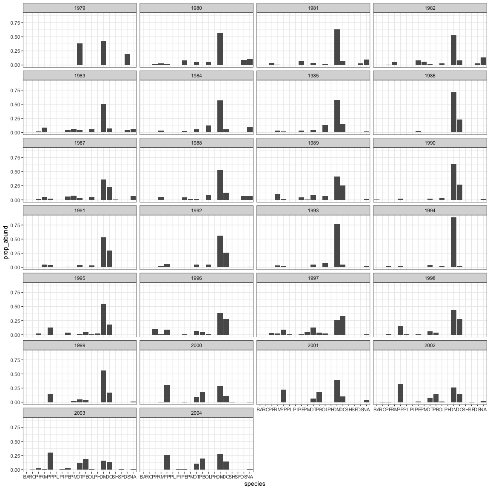
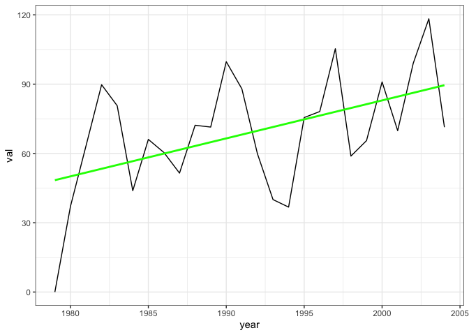

toy portal
================

``` r
all_rats <- summarize_individual_rodents(clean = TRUE)
```

    ## Loading in data version 1.127.0

``` r
rats <- all_rats %>%
  filter(treatment == "spectabs", !is.na(wgt)) %>%
  mutate(er = 5.69 * (wgt ^ .75)) %>%
  select(year, species, wgt, er) %>%
  group_by(year) %>%
  summarize(abund = dplyr::n(),
            totale = sum(er),
            avge = totale/abund) %>%
  ungroup() %>%
  tidyr::gather(-year, key = "variable", value = "val")

ggplot(data = rats, aes(x = year, y = val)) +
  geom_line() +
  theme_bw() +
  facet_wrap(vars(variable), scales = "free_y") +
  geom_smooth(method = "lm", se = F, color = "green")
```


``` r
ar_spectra <- all_rats %>%
  filter(!is.na(wgt), treatment == "spectabs") %>%
  mutate(er = 5.69 * (wgt ^ .75)) %>%
  select(year, er, wgt) %>%
  group_by(year) %>%
  mutate(er_wgt = er / sum(er)) %>%
  ungroup()
ggplot(data = ar_spectra, aes(x = wgt)) +
  geom_density() +
  geom_density(aes(x = wgt, weight =er_wgt), color = "purple") +
  facet_wrap(vars(year)) +
  theme_bw()
```


``` r
ar_species <- all_rats %>%
  filter(!is.na(wgt), treatment == "spectabs") %>%
  select(year, wgt, species) %>%
  mutate(species = as.character(species)) %>%
  group_by(species) %>%
  mutate(mean_wgt = mean(wgt)) %>%
  group_by(year, species, mean_wgt) %>%
  summarize(abund = dplyr::n()) %>%
  ungroup() %>%
  group_by(year) %>%
  mutate(prop_abund = abund / sum(abund)) %>%
  ungroup()

spp_levels <- ar_species %>%
  select(species, mean_wgt) %>%
  distinct() %>%
  arrange(mean_wgt)

ar_species <- ar_species %>%
  mutate(species = factor(species, levels = spp_levels$species))

ggplot(data = ar_species, aes(x = species, y = prop_abund)) +
  geom_col() +
  theme_bw() +
  facet_wrap(vars(year), nrow = 7)
```



``` r
ar_mat <- ar_species %>%
  select(year, species, abund) %>%
  tidyr::pivot_wider(names_from = species, values_from = abund, values_fill = list(abund = 0))

ar_years <- ar_mat$year

ar_mat <- select(ar_mat, -year)

dist_mat <- dist(ar_mat)

dist_from_start <- data.frame(
  year = ar_years,
  val = c(0, dist_mat[1:25]),
  variable = as.character("dist_from_start")
)

rats <- bind_rows(rats, dist_from_start)
```

    ## Warning in bind_rows_(x, .id): binding character and factor vector, coercing
    ## into character vector

``` r
ggplot(data = rats, aes(x = year, y = val)) +
  geom_line() +
  theme_bw() +
  facet_wrap(vars(variable), scales = "free_y") +
  geom_smooth(method = "lm", se = F, color = "green")
```



``` r
rats2 <- all_rats %>%
  filter(treatment == "control", !is.na(wgt), period > 100) %>%
  mutate(er = 5.69 * (wgt ^ .75)) %>%
  select(year, er, wgt) %>%
  group_by(year) %>%
  mutate(er_wgt = er / sum(er)) %>%
  ungroup()

 ggplot(data = rats2, aes(x = wgt)) +
  geom_density() +
  geom_density(aes(x = wgt, weight = er_wgt), color = "green") +
  facet_wrap(vars(year), scales = "free_y") +
  theme_bw()
```


The green line is the ISD weighted by energy use.

Here we see a leftward shift/a loss of big species.
