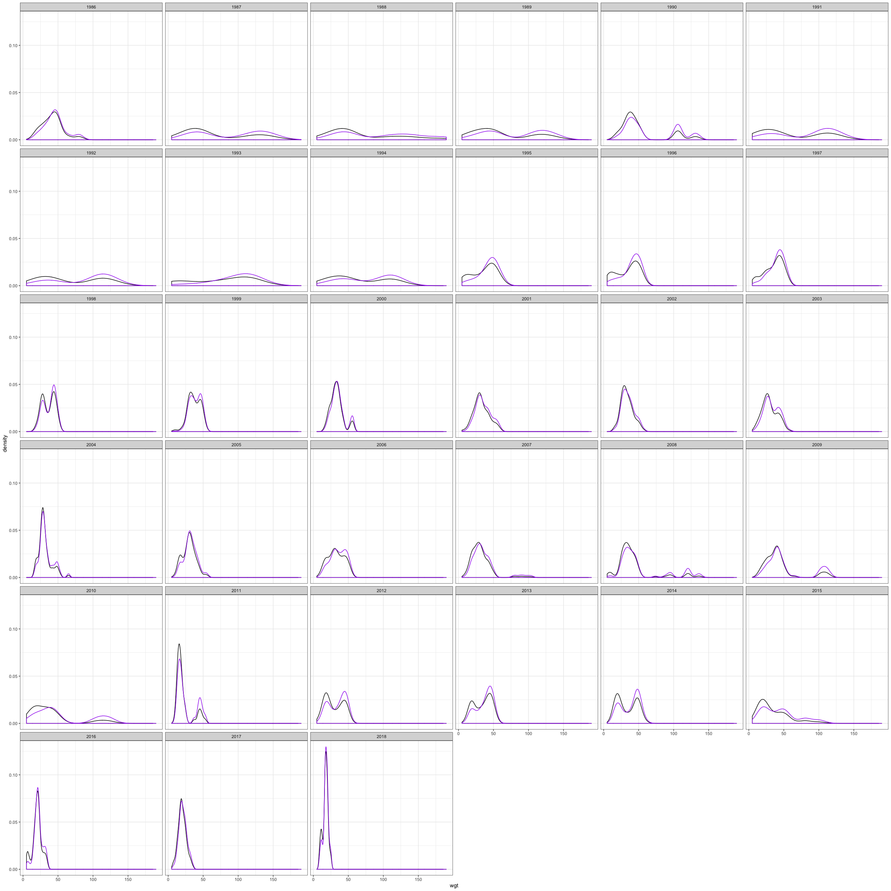

toy portal
================

``` r
all_rats <- summarize_individual_rodents(clean = TRUE)
```

    ## Loading in data version 1.127.0

``` r
rats <- all_rats %>%
  filter(plot %in% c(5, 22), !is.na(wgt), period > 100) %>%
  mutate(er = 5.69 * (wgt ^ .75)) %>%
  select(year, plot, species, wgt, er) %>%
  group_by(year, plot) %>%
  summarize(abund = dplyr::n(),
            totale = sum(er),
            avge = totale/abund) %>%
  ungroup() %>%
  tidyr::gather(-plot, -year, key = "variable", value = "val")

ggplot(data = rats, aes(x = year, y = val)) +
  geom_line() +
  theme_bw() +
  facet_wrap(vars(plot, variable), scales = "free_y") +
  geom_smooth(method = "lm", se = F, color = "green")
```


``` r
ar_spectra <- all_rats %>%
  filter(!is.na(wgt), plot %in% c(5,22), period > 100) %>%
  mutate(er = 5.69 * (wgt ^ .75)) %>%
  select(year, plot, er, wgt) %>%
  group_by(year, plot) %>%
  mutate(er_wgt = er / sum(er)) %>%
  ungroup()
ggplot(data = filter(ar_spectra, plot == 5), aes(x = wgt)) +
  geom_density() +
  geom_density(aes(x = wgt, weight =er_wgt), color = "purple") +
  facet_wrap(vars(year)) +
  theme_bw()
```


``` r
ggplot(data = filter(ar_spectra, plot == 22), aes(x = wgt)) +
  geom_density() +
  geom_density(aes(x = wgt, weight =er_wgt), color = "purple") +
  facet_wrap(vars(year)) +
  theme_bw()
```



``` r
rats2 <- all_rats %>%
  filter(treatment == "control", !is.na(wgt), period > 100) %>%
  mutate(er = 5.69 * (wgt ^ .75)) %>%
  select(year, er, wgt) %>%
  group_by(year) %>%
  mutate(er_wgt = er / sum(er)) %>%
  ungroup()

 ggplot(data = rats2, aes(x = wgt)) +
  geom_density() +
  geom_density(aes(x = wgt, weight = er_wgt), color = "green") +
  facet_wrap(vars(year), scales = "free_y") +
  theme_bw()
```


The green line is the ISD weighted by energy use.

Here we see a leftward shift/a loss of big species.
